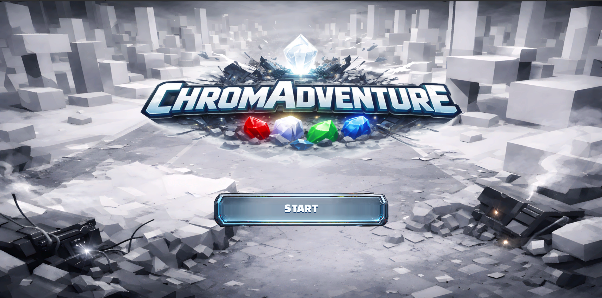
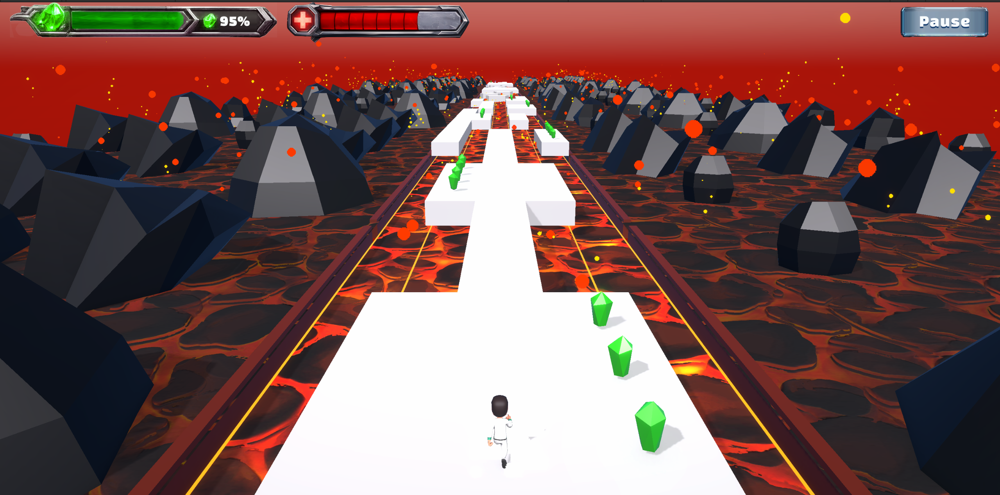
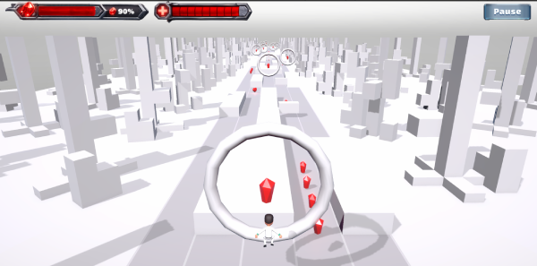
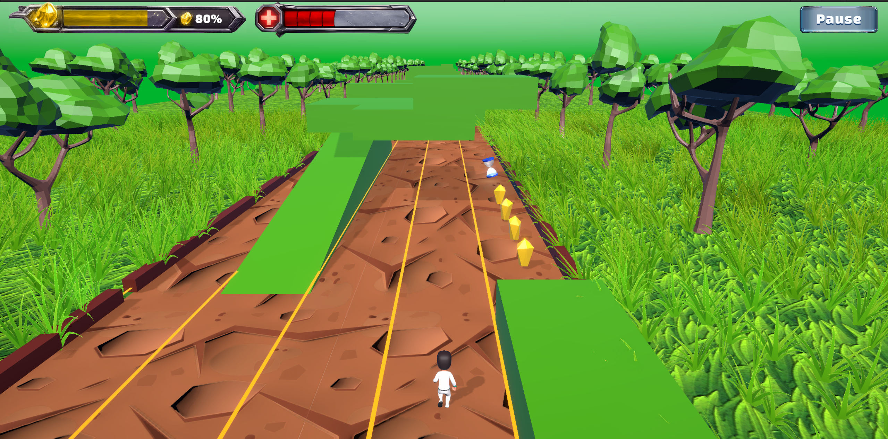
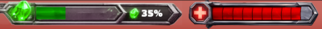
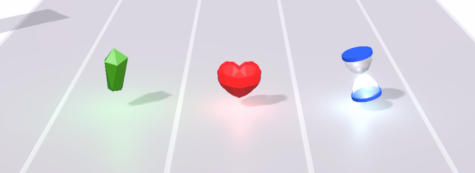
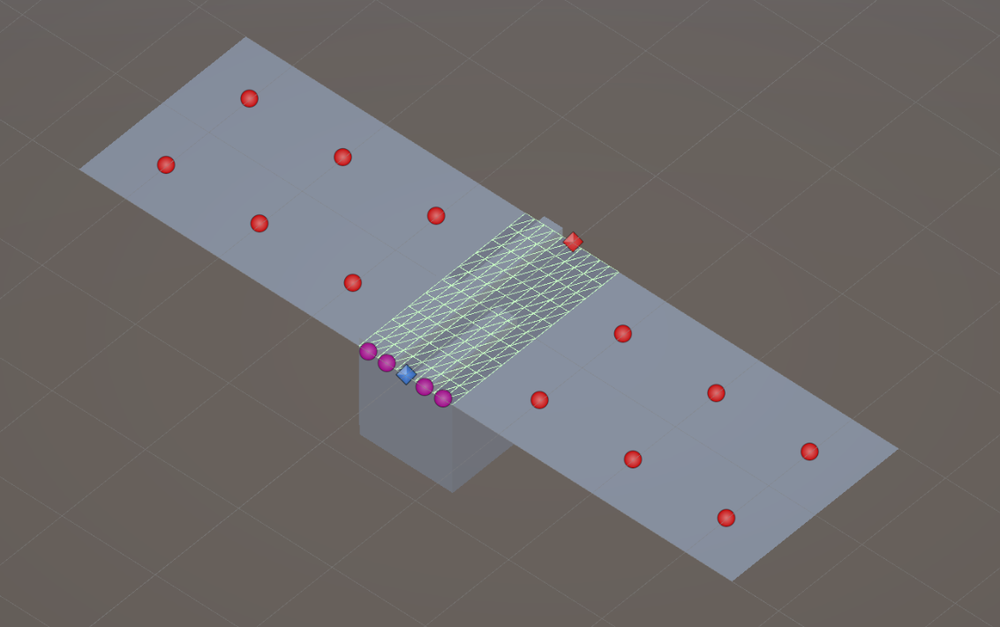

# Pour jouer


Le jeu est disponible en ligne ici (Build WebGL et Linux) :
[Itch.io - ChromAdventure](https://kzlucas.itch.io/chromadventure)







# Introduction

Ce repo contient le code source et les ressources du projet Unity du jeu **ChromAdventure**.
Il s'agit d'un jeu d'aventure en 3D de type *Infinite Runner* créé dans le cadre du cours de Programmation de Jeux Vidéo dispensé par Gaming Campus.

Le cahier des charges du projet est disponible ici : [GamingCampus-CDC-dev-jv.pdf](Documentation/GamingCampus-CDC-dev-jv.pdf).

Les spécifications principales du jeu sont les suivantes :

- Utilisation du moteur Unity3D,
- Environnement 3D,
- Parcours de jeu généré procéduralement et uniquement linéaire,
- Gameplay évolutif,
- Présence d’obstacles sur le parcours,
- Persistance des données en JSON.


## Organisation du travail

Le projet a été réalisé par un seul développeur, Lucas Tesseron ([@kzlucas](https://github.com/kzlucas) sur GitHub), en tant que projet de fin de cours de développement de jeux vidéo. Le développement a duré environ 6 semaines, avec une moyenne de 15 à 20 heures par semaine consacrées au projet.

Le développement de ce prototype du jeu a démarré mi décembre 2025 et s'achève début février 2026.

## Suivi des features

Tableau de suivi des principales features développées au cours du projet ([Google Sheet Document](https://docs.google.com/spreadsheets/d/1VynXDeEw_dpZwPe93qpfKKuDYcDk6X5uEqaUhXpRSZ0/edit?gid=0#gid=0))

#### Niveaux de priorites :
- P0 : Necessaire au prototype
- P1 : Necessaire a la coherance global du jeu
- P2 : Amelioration du Game Play / Amelioration cosmetiques / Amelioration de l architecture du projet


| Tâche                                                                                       | Priorité | Date de début   | Date de fin | Description                                                                                                                                                                                               | Référence |
| ------------------------------------------------------------------------------------------------------ |----|------------|-------------|-----------------------------------------------------------------------------------------------------------------------------------------------------------------------------------------------------------|-----------|
| Redaction documentation                                                                                | P0 | 07/12/2025 | 01/02/2026 | Documentation des methodes + de l'architecture generale du projet                                                                                                                                        | readme https://github.com/kzlucas/infinite-runner |
| Edge colliders: entre les segments du parcours, le player bounce sur les jonctions entre les segments  | P0 | 07/12/2025 | 10/12/2025 | Creation dun Composite collider, qui va agreger / merger tous les colliders dans la scene                                                                                                                | commit https://github.com/kzlucas/infinite-runner/commit/e7705c70a2f486e3a69eb641e79dab421133e2e9#diff-50784cdfc54ba57455a19667a18cd3515e5572c91083faf05993ec5c3fc5ea4c |
| Implementation du Jump pour le player                                                                  | P0 | 05/12/2025 | 02/01/2026 | Ajout d'une animation specifque. Ajout d'un etat dans la machine a etats. Ajout d'un Rigidbody et d'un AddForce sur le Player gameObject                                                                 | file https://github.com/kzlucas/infinite-runner/blob/main/Assets/Scripts/Player/States/PlayerStatesJump.cs |
| Implementation du Slide pour le player                                                                 | P0 | 12/12/2025 | 02/01/2026 | Ajout d'une animation specifque. Ajout d'un etat dans la machine a etats.Modifie les dimensions des colliders pour permettre de  passer sous les elements du Level Design                                | file https://github.com/kzlucas/infinite-runner/blob/main/Assets/Scripts/Player/States/PlayerStatesSlide.cs |
| Implementation du Crash                                                                                | P0 | 12/12/2025 | 02/01/2026 | Ajout d'une animation specifque. Ajout d'un etat dans la machine a etats. Creation d'un ecran de fin de niveau                                                                                           | file https://github.com/kzlucas/infinite-runner/blob/main/Assets/Scripts/Player/States/PlayerStatesCrash.cs |
| Creation d'un systeme UI                                                                               | P0 | 19/12/2025 | 22/01/2026 | Utilisation de UI Toolkit pour la creation des differents ecrans UI du jeu. Scripts de logique UI et interactions utilisateur                                                                            | file https://github.com/kzlucas/infinite-runner/tree/main/Assets/Scripts/UI |
| Systeme d'initialisation du jeu                                                                        | P0 | 20/12/2025 | 18/12/2025 | Systeme d'initialisation des composants du jeu lors du chargenent des scenes                                                                                                                             | file https://github.com/kzlucas/infinite-runner/blob/main/Assets/Scripts/SceneCore/SceneInitializer.cs |
| Ajout de musique et SFX                                                                                | P1 | 21/12/2025 | 29/01/2026 | Integration d'un singleton AudioManager qui va permettre de mapper les evenements du jeu avec les fichiers audios a lire                                                                                 | file https://github.com/kzlucas/infinite-runner/blob/main/Assets/Scripts/SceneCore/AudioManager.cs |
| Creation procedurale des segments du monde                                                             | P0 | 23/12/2025 | 28/01/2026 | Creation d'un systeme de generation procedurale des differents biomes du jeu                                                                                                                             | files https://github.com/kzlucas/infinite-runner/tree/main/Assets/Scripts/WorldGeneration |
| Gestion de la recolte des collectibles pour passer d un monde a l autre                                | P0 | 13/01/2026 | 17/01/2026 | Creation d un manager dédié et d'un HUD pour suivre la progression du joueur                                                                                                                             | file https://github.com/kzlucas/infinite-runner/blob/main/Assets/Scripts/PaintManager.cs |
| Systeme de sauvegarde                                                                                  | P1 | 14/01/2026 | 14/01/2026 | Creation d un service de sauvegarde des donnees du jeu en JSON sur la machine hote, Creation d un systeme de sauvegarde dans les PlayerPrefs pour les settings du joueur (audio on/off notament)         | files https://github.com/kzlucas/infinite-runner/tree/main/Assets/Scripts/DataServices |
| Gestion de la fin de partie et donnees de progression du joueur                                        | P1 | 14/01/2026 | 22/01/2026 | Creation d une UI dediee. Sauvegarde des Stats de  jeu du joueur et affichage                                                                                                                            | commit https://github.com/kzlucas/infinite-runner/commit/0f83f53116e9db30b6a832b96e00a7717894ef9b#diff-e63ece348a909b393a445f40a0df0975658be2c3abe1f33788a5f233e8780dcc |
| Ajout d un tutorial au lancement du jeu                                                                | P2 | 19/01/2026 | 24/01/2026 | Creation d une UI dediee. Sauvegarde de la progression du joueur dans le tutorial. Creation de l environnement du tutorial                                                                               | files https://github.com/kzlucas/infinite-runner/tree/main/Assets/Scripts/Tutorials |
| Implementation d une State Machine pour une meilleur gestion de l etat du joueur                       | P2 | 22/01/2026 | 22/01/2026 | Creation d une StateMachine generique. Implementation pour le Player                                                                                                                                     | commit https://github.com/kzlucas/infinite-runner/commit/f73baa9eea104c7caac9d234ee13997b3e27a577 |
| Creation d un systeme de points de vies                                                                | P0 | 27/01/2026 | 28/01/2026 | Creation de l'UI dans le HUD. Desactiver le collider lors de un crash avec un obstacle. Implementer l invincibilité pour les x prochaines secondes. Gerer la physique                                    | |
| Ajout d'un collectible Coeur pour regagner un PV                                                       | P1 | 29/01/2026 | 29/01/2026 | Ajout d un model 3D. Ajout d un script sepecifique de logique lors de la recuperation par le joueur, Ajout d un son specifique lors de la collecte                                                       | |
| Ajout d'un collectible Sablier pour ralentir le temps                                                  | P1 | 29/01/2026 | 29/01/2026 | Ajout d un model 3D. Ajout d un script sepecifique de logique lors de la recuperation par le joueur, Ajout d un son specifique lors de la collecte                                                       | |
| Refactoring general et bonnes pratiques                                                                | P2 | 29/01/2026 | 01/02/2026 | Revue globale du code source sur une branche dediee. Renommage des variables selon leur scope / veiller a l'architecture par composants / ajouter les namespace manquants                                | branch 'refactoring' | 


## Credits

Le jeu est créé sur la base du Game Design Document (GDD) suivant : [ChromAdventure_Game-Design-Document.pdf](Documentation/ChromAdventure_Game-Design-Document.pdf).

Les personnes ayant participé à la création de ce GDD sont :

- Alex Gonzalez 
- Lucas Mortier 
- Lucas Tesseron
- Mina Ineflas 
- Nathan Letessier
- Rudy Luna 
- Samuel Zerbib 
- Sébastien Frayssinet
- Thomas Menant 
- Vincent Distribué
- Sylvain Marignale

Les comptes rendus des réunions de création du GDD sont disponibles ici [ChromAdventure_Game-Design-Document_Comptes-rendu-reu.pdf](Documentation/ChromAdventure_Game-Design-Document_Comptes-rendu-reu.pdf).

L'enseignant encadrant le projet est :

- Yona Rutkowski ([@Skuuulzy](https://github.com/Skuuulzy))

Le projet ayant été développé par l'enseignant durant les cours est disponible ici : [InfiniteRunnerMontreal
](https://github.com/Skuuulzy/InfiniteRunnerMontreal) 


Les assets du projets notamment graphiques et sonores proviennent de ressources libres de droits :

- Musique - [licence](https://pixabay.com/service/license-summary/)
    - Musique du menu principal : ["Ambient game"](https://pixabay.com/sound-effects/musical-ambient-game-67014/) de JeltsinSH
    - Musique de fond du jeu : ["Game Roblox Gaming Background Music"](https://pixabay.com/music/bloopers-game-roblox-gaming-background-music-347589/) de Tunetank

- Effets sonores - [licence](https://pixabay.com/service/license-summary/)
    - [265 - fiezewarthog](https://pixabay.com/sound-effects/film-special-effects-265-41177/)
    - [Button Click - freesoundeffects](https://pixabay.com/sound-effects/film-special-effects-button-click-289742/)
    - [land2 - deleted_user_10023915](https://pixabay.com/sound-effects/film-special-effects-land2-43790/)
    - [Magazine Slide - MootMcnoodles](https://pixabay.com/sound-effects/film-special-effects-magazine-slide-100131/)
    - [Drop Coin - Crunchpix Studio](https://pixabay.com/sound-effects/film-special-effects-drop-coin-384921/)
    - [Thump - Macif](https://pixabay.com/sound-effects/household-thump-105302/)
    - [HealPop - shyguy014](https://pixabay.com/sound-effects/film-special-effects-healpop-46004/)

- Models 3D
    - [Kenney - Animated Characters 2](https://kenney.nl/assets/animated-characters-2) - [licence CC0 1.0 Universal (CC0 1.0) Public Domain Dedication](https://creativecommons.org/publicdomain/zero/1.0/)
    - [Transparent Glass Hourglass - Ayd3n91](https://sketchfab.com/3d-models/transparent-glass-hourglass-4249e12fc0904c28886ea688daced98c) - [licence CC AttributionCreative Commons Attribution](https://creativecommons.org/licenses/by/4.0/)
    - [Low Poly Spinning Heart! - mano1creative](https://sketchfab.com/3d-models/low-poly-spinning-heart-17cf0dbe4435434eb6e04394fd5bf7ae) - [licence CC AttributionCreative Commons Attribution](https://creativecommons.org/licenses/by/4.0/)
    
- Splash screen du jeu et elements UI et HUD

    - Généré par DALL·E 3 (https://chat.openai.com/) - [Usage commercial et non-commercial autorisé](https://openai.com/policies/terms-of-use/)
    

# Description et fonctionnement du jeu


## Concept du jeu

**ChromAdventure** est un jeu d'aventure en 3D de type *Infinite Runner* où le joueur incarne un personnage qui court à travers des environnements colorés et variés. Le but du jeu est de collecter des cristaux tout en évitant des obstacles pour atteindre le score le plus élevé possible.

## Le scenario

*Un chercheur obsédé par la preuve des mondesparallèles active une machine expérimentale.L’appareil se brise, le projet échoue... et lui estaspiré dans un univers sans couleurs. Pour rentrer chez lui, il doit voyager de monde enmonde. Chaque univers possède une couleur unique et renferme un cristal essentiel pour réparer la machine. À mesure qu’il les récupère,les couleurs reviennent peu à peu dans les mondes traversés. Son voyage devient une reconstruction : celle de la machine, des couleurs, et de son propre monde, qu’il espère retrouver intact une fois toutes les teintes rassemblées.*


## Limites du prototype

Ce prototype de jeu implémente les fonctionnalités de base du gameplay décrit dans le GDD. Cependant, certaines fonctionnalités avancées et certains contenus prévus dans le GDD n'ont pas été implémentés dans ce prototype en raison de contraintes de temps et de ressources. Voici quelques-unes des limitations actuelles du prototype :

### 🌕 Elements complets :

- Mécaniques de base du gameplay (déplacement latéral, saut, glissade, collecte de cristaux, évitement d'obstacles).
- Système de génération procédurale du monde.
- Système de rewind après collision avec un obstacle.
- Système de score basé sur la distance parcourue et les cristaux collectés.
- Interface utilisateur de base (menu principal, HUD en jeu, écran de fin de partie).
- Système audio avec musique de fond et effets sonores.
- Système de sauvegarde des statistiques du joueur (meilleur distance parcouru, cristaux collectés).
- Systeme de tutoriel pour guider les nouveaux joueurs.

### 🌗 Elements partiellement implémentés :

- Système de génération procédurale du monde avec 3 biomes différents et 9 segments de monde réutilisables.
- 3 collectibles différents implementes (cristal, coeur, sablier) contre 8 proposes dans le GDD.

### 🌘 Elements non implémentés :

- Ecran de selection du monde.
- Le jeu est infini et ne comporte pas d'elements de scenario.


## Contrôles du jeu

- **Naviguer dans les menus** : Utilisez la souris pour cliquer sur les boutons du menu.
- **Déplacement Latéral** : Utilisez les flèches gauche et droite ou les touches A et D pour déplacer le personnage latéralement entre trois voies.
- **Saut** : Appuyez sur la barre d'espace pour faire sauter le personnage.
- **Glissade** : Appuyez sur la fleche haut pour faire glisser le personnage sous les obstacles.
- **Pause** : Appuyez sur la touche Échap ou cliquez sur le bouton Pause pour mettre le jeu en pause et accéder au menu de pause.

## Progression et Difficulté

La vitesse de deplacement du joueur augmente legerement au fur et a mesure du temps (voir [`TimeScaleManager`](Assets/Components/TimeScale/TimeScaleManager.cs)).

Les obstacles deviennent egalement plus frequents et plus difficiles a eviter au fur et a mesure que le joueur progresse dans les mondes.

## HUD

Une jauge de progression est affichée en haut de l'écran pour indiquer au joueur combien de cristaux il doit encore collecter pour atteindre le prochain monde.

Un indicateur du nombre de points de vie restants est egalement present en haut de l'ecran.




## Mondes

Le jeu comporte plusieurs mondes générés procéduralement, chacun avec un thème et une palette de couleurs distincts. Les mondes sont composés de segments réutilisables qui sont assemblés de manière aléatoire pour créer un parcours unique à chaque partie.

- Le premier monde implémenté dans ce prototype est le **Monde blanc**.
- Le deuxième monde est le **Monde de lave** qui utilise une palette de couleurs rouge/orange.
- Le troisième monde est le **Monde foret** qui utilise une palette de couleurs verte.

Chaque monde a ses propres obstacles et éléments de décor. Une fois que le joueur a collecté un certain nombre de cristaux, il passe au monde suivant.

Le changement de monde est accompagné d'une transition visuelle et sonore pour renforcer l'immersion du joueur. A noter que les segments du monde sont retires et regeneres *en temps reel* lors du changement de monde (pas d'interruption du gameplay).   


### Collectibles

Trois types de collectibles sont implémentés dans ce prototype :

- **Cristaux** : Collecter des cristaux augmente le score du joueur et contribue à la progression vers le prochain monde.
- **Cœurs** : Collecter des cœurs restaure un point de vie au joueur.
- **Sablier** : Collecter un sablier ralentit temporairement la vitesse de déplacement du joueur, facilitant ainsi l'évitement des obstacles.



### Obstacles

Categories d'obstacles implémentées dans ce prototype :

- **Obstacles fixes** : Obstacles statiques.
  - Soit des obstacles necessitant un saut,
  - Soit des obstacles necessitant une glissade.
  - Soit des obstacles latéraux à éviter en se déplaçant sur les côtés.
  - Soit des obstacles combinant plusieurs de ces actions.
- **Plateformes mobiles** : Plateformes en mouvement dans le monde de lave. Si le joueur tombe de la plateforme, il perd un point de vie.
  
La difficulte reside dans le choix de la bonne action a effectuer dans le bon timing.


### Randomisation des obstacles et collectibles

Les obstacles sont placés de manière aléatoire sur les troncons de monde générés via un systeme de slots. Chaque segment de monde contient des emplacements prédéfinis (slots) où les obstacles peuvent être placés. Lors de la génération du monde, les obstacles sont sélectionnés aléatoirement parmi une liste d'obstacles disponibles et placés dans ces slots.

Sur le schéma ci-dessous, les emplacements des slots sont représentés par les **points violets et bleus**. Les **obstacles** sont placés dans ces emplacements lors de la génération du segment de monde.

Les **points rouges** correspondent aux emplacements des **elements de decor** (arbres, rochers, etc.) qui ne sont pas des obstacles.



La randomisation des obstacles se fait via plusieurs stratégies :

- [`WorldGenerator.SelectionStrategy`](Assets/Components/WorldGenerator/Scripts/WorldSegmentSelectionStrategy.cs) : Définit la stratégie de sélection des segments de monde à instancier. (random simple parmis les segments disponibles pour le biome courant).
- [`RandomizePosition`](Assets/Components/WorldGenerator/Scripts/Utils/RandomizePosition.cs) : Place l'obstacle dans un emplacement aléatoire parmi les slots disponibles.
- [`RandomizeInstanciation`](Assets/Components/WorldGenerator/Scripts/Utils/RandomizeInstanciation.cs) : Determine la probabilité d'apparition d'un obstacle/collectible.


# Environnement de développement

Le projet a été réalisé avec le moteur de jeu **Unity (version 6000.2.8f1)** et utilise le langage de programmation C#. Il a été développé sous Linux, en utilisant l'IDE **Visual Studio Code**. À noter que le projet cible deux plateformes de build : Linux et WebGL. Il prend donc en considération les contraintes et les optimisations nécessaires pour ces plateformes (WebGL en particulier).


# Procedure de Tests

Les tests unitaires et les tests d'intégration n'ont pas été mis en place dans ce projet en raison de contraintes de temps et de ressources.

Cependant, des tests manuels ont été effectués pour vérifier le bon fonctionnement des principales fonctionnalités du jeu.

Tout au long du développement:
- en utilisant la console de l'éditeur Unity avec [`de nombreux Debug`](https://github.com/search?q=repo%3Akzlucas%2Finfinite-runner%20Debug&type=code) : `Debug.Log`, `Debug.DrawRay`, `Debug.Break`, `OnDrawGizmos`...
- en utilisant l'éditeur Unity pour simuler différentes situations de jeu et vérifier les comportements attendus.
- en jouant au jeu régulièrement pour identifier et corriger les bugs et les problèmes de gameplay.
- en faisant des builds du jeu pour tester les performances et la compatibilité sur différentes plateformes (Linux et WebGL).
- en utilisant une classe `Editor` [`EditorMenuExtras`](Assets/Components/Editor/EditorMenuExtras.cs) pour lancer des fonctions  depuis le menu de l'éditeur Unity.

Le prototype a été envoyé au groupe de travail sur Discord pour demander des retours et identifier d'éventuels bugs ou problèmes de gameplay. Quelques bugs ont été remontés et corrigés avant la version finale du prototype.


## Description de la procedure de test manuelle utilisee :

1. Démarrer le jeu
2. Vérifier l'affichage du menu principal
3. Cliquer sur Start
4. Vérifier le chargement de la scène de jeu
5. Vérifier le système de génération procédurale du monde
6. Jouer au jeu
  - Vérifier le déplacement du personnage
  - Vérifier le saut et la glissade
  - Vérifier la collecte des cristaux
  - Vérifier les collisions avec les obstacles
  - Vérifier la perte de points de vie
  - Vérifier le système de rewind
  - Vérifier l'affichage du score et des cristaux collectés
7. Perdre la partie
  - Vérifier l'affichage de l'écran de fin de partie
  - Vérifier le calcul du score final
8. Redémarrer une nouvelle partie
  - Vérifier le rechargement de la scène de jeu
  - Recommencer les tests de jeu (1 à 6)
9. Vérifier les paramètres audio
  - Muter et démuter le son
  - Vérifier le volume sonore
10. Vérifier la mise en pause du jeu
  - Vérifier l'ouverture/fermeture du menu pause en appuyant sur Échap
  - Vérifier l'ouverture/fermeture du menu pause en appuyant sur le bouton Pause
  - Reprendre le jeu
  - Vérifier la reprise du jeu
11. Arrêter le jeu
15. Vérifier si le fichier local de sauvegarde a bien été écrit
12. Démarrer le jeu
15. Vérifier la persistance des statistiques du joueur (meilleur score, cristaux collectés) après redémarrage du jeu
13. Vérifier la persistance des paramètres audio dans le menu
14. Arrêter le jeu
15. Vérifier les erreur et warnings dans la console de l'éditeur Unity et corriger si nécessaire


## Description de la procédure de test du Tutorial utilisée :

1. Supprimer les PlayerPrefs dans l'éditeur Unity
2. Supprimer le fichier de sauvegarde local (savefile.json) s'il existe (méthode Editor `SaveService::DeleteSave`)
3. Démarrer le jeu
4. Vérifier l'affichage du menu principal
5. Cliquer sur Start
6. Vérifier le chargement de la scène de jeu
7. Jouer et vérifier la completion du tutorial pas à pas :
  - Vérifier l'affichage du message "Comment se Déplacer horizontalement"
  - Vérifier l'affichage du message "Comment Sautez"
  - Vérifier l'affichage du message "Comment Glissez"
  - Vérifier l'affichage du message "Collectez des Cristaux"
  - Vérifier l'affichage du message "Tutoriel complété"
8. Arrêter le jeu
9. Démarrer le jeu
10. Vérifier que le tutorial ne se lance pas à nouveau

## Procedure de test des mondes

À noter que pour chaque nouveau segment de monde ajoutés au cours du développement, une procédure de test manuelle a été réalisée pour vérifier que le segment s'intègre correctement dans le système de génération procédurale du monde mais aussi qu'il ne provoque pas de problèmes de collisions ou de rebondissements indésirables, que le joueur peut bien le franchir, que les obstacles sont bien placés, etc.

## Exemples de cas concrets de bugs identifiés et corrigés


### Bug 1

**Description** : Lorsqu'on appuie sur la touche Entrée durant le jeu, cela trigger des événements inattendus dans l'UI.
**Methode d'identification** : Playtest de Sylvain Marignale.
**Correction** : Dans l'UI Toolkit, par defaut la touche Entrée va propager une evenement sur le Bouton qui est en focus. Il a fallu apres avoir identifier la cause du bug, configurer le composant `Input System UI Input Module` pour supprimer l'assignation par defaut de la touche Entrée au comportement de `Submit`.

### Bug 2

**Description** : Lors de l'execution du build WebGL, certains composants qui implementent l'interface `IInitializable` ne sont pas initialises correctement, ce qui empeche le jeu de fonctionner correcetement.
**Methode d'identification** : Test du build WebGL.
**Correction** : Le probleme venait du fait que dans le build WebGL ne supporte pas correctement le multithreading. Certains composants utilisaient des threads pour effectuer des taches d'initialisation en arriere plan, ce qui causait des problemes lors de l'execution du build WebGL. La solution a ete de modifier ces composants pour qu'ils effectuent l'initialisation sur le thread principal.

### Bug 3

**Description** : Le player rebondit de maniere inattendue lorsqu'il marche sur les jonctions entre les segments du monde.
**Methode d'identification** : Test du jeu dans le Play Mode de l'éditeur Unity.
**Correction** : Le probleme venait du fait que chaque segment de monde avait son propre collider, ce qui causait des problemes de rebondissements aux jonctions entre les segments. La solution a ete de creer un composant `SquareCollidersMerger` qui merge tous les colliders des segments du monde en un seul collider continu, eliminant ainsi les rebondissements indésirables.

### Bug 4

**Description** : Les collectibles Crystaux augmentaient plusieurs fois le score du joueur lorsqu'ils étaient collectés. Au lieu d'augmenter le compteur de cristaux d'une unité, ils l'augmentaient de 4.
**Methode d'identification** : Test du jeu dans le Play Mode de l'éditeur Unity.
**Correction** : Le probleme venait du fait que la méthode de collecte des cristaux (`OnCollide`) était appelée plusieurs fois en raison de collisions multiples détectées lors de la collecte. La solution a été d'ajouter un flag booléen `isCollected` dans le [script du collectible](Assets/Components/Collectible/Scripts/CollectibleCrystal.cs) pour s'assurer que la logique de collecte ne soit exécutée qu'une seule fois par collectible.


# Organisation du code

## Structure du Repo

- `Documentation/` : Contient la documentation du projet, y compris le GDD et d'autres ressources pertinentes.

- `Assets/` : Contient tous les assets du projet Unity, y compris les scripts, les modèles 3D, les textures, les sons, etc.

    - `Assets/Components/` : Contient les composants réutilisables du projet, tels que le système de génération de monde, le gestionnaire d'audio, etc.
      - `Assets/Components/**` Chaque composant a son propre dossier avec ses scripts, prefabs et data le cas échéant.
    - `Assets/Graphics/` : Contient les ressources graphiques du projet, telles que les textures, les sprites, etc.
    - `Assets/Models/` : Contient les modèles 3D utilisés dans le projet.
    - `Assets/Resources/` : Contient la typographie utilisee dans l'interface du jeu.
    - `Assets/Scenes/` : Contient les différentes scènes du jeu.
    - `Assets/Settings/` : Contient les paramètres de configuration du projet Unity.
    - `Assets/Shaders/` : Contient les shaders utilisés dans le projet.
    - `Assets/Terrains/` : Contient les ressources liées aux terrains utilisés dans le projet.

## Commentaire de code et formatage

Les méthodes et les classes sont commentées **en anglais** à l'aide de commentaires XML pour faciliter la compréhension du code et la génération de documentation automatique.

À noter que les **commentaires XML** sont utilisés principalement pour documenter les **classes et les méthodes publiques**, tandis que les commentaires en ligne (// ou /* */) sont utilisés pour expliquer des sections de code plus complexes ou des logiques spécifiques.

Le code source du projet suit en partie les **conventions de nommage et de formatage standard de C#.** Les classes, méthodes et variables sont nommées de manière descriptive pour faciliter la compréhension du code.

Ici les conventions de nommage et de formatage utilisées dans ce projet :

- ✅ PascalCase (UpperCamelCase) : Classes, méthodes, propriétés, espaces de noms (namespaces), interfaces (IInterface)
- ✅ camelCase (LowerCamelCase) : Variables locales, paramètres de méthode
- ✅ Champ privé (private fields) : _camelCase (underscore + camelCase).
- ✅  Constantes : PascalCase
- ✅ Interfaces : Commencent par une majuscule 'I'.
- ✅ Booléens : Préfixer par Is, Can, Has. 
- ⚠️ Accolades : Utiliser le style Allman (accolades ouvrant et fermant sur une nouvelle ligne). --> Sur ce point, j'ai assez souvent omis les accolades lorsqu'il n'y avait qu'une seule instruction dans un bloc conditionnel ou de boucle. Pour le reste le style Allman a été respecté.
- ✅ Indentation : 4 espaces (ne pas utiliser de tabulations).
- ✅ `var` keyword : Utiliser var lorsque le type est évident à droite de l'assignation, sinon préciser le type.
- ✅ Nommage des fichiers : Faire correspondre le nom de la classe au nom du fichier (ex: Class1.cs).
- ✅ Commentaires : Utiliser // pour les commentaires sur une seule ligne. 


# Architecture du code

Modèle d'Architecture : Basé sur les **Composants** avec une conception orientée **Services**.

- Système de [`Components`](Assets/Components) modulaire. Chaque composant a ses propres dossiers *Scripts*, *Prefabs* et *Data* le cas échéant

- Architecture Basée sur les `Événements`. Les composants peuvent communiquer sans références directes via [`EventBus`](Assets/Components/Events/EventBus.cs) pour une communication découplée.
    - eg. [`SceneEvents`](Assets/Components/SceneCore/SceneEvents.cs) pour les événements liés au chargement des scènes (OnSceneLoaded, OnSceneExit, etc.)
    - eg. [`AudioEvents`](Assets/Components/Audio/Scripts/AudioEvents.cs) pour les événements audio (OnSoundPlayed, OnMusicChanged, etc.)
- Modèle [`Singleton`](Assets/Components/Singleton/Singleton.cs) - Pour les gestionnaires et services globaux
    - eg. [`AudioManager`](Assets/Components/Audio/Scripts/AudioManager.cs), 
    - eg. [`InputHandlersManager`](Assets/Components/InputsHandler/InputsHandlerManager.cs), 
    - eg. [`SceneLoader`](Assets/Components/SceneCore/SceneLoader.cs)
- Modèle `StateMachine` - Implémentation explicite de machines à états. 
    - eg. [`Player.States.*`](Assets/Components/Player/Scripts/States) avec différents états (Move, Jump, Slide, Crash, etc.)
- Modèle `DataServices` pour la persistance. Enregistrement et chargement des données en JSON ou PlayerPrefs.
    - eg. [`PlayerPrefService`](Assets/Components/DataServices/PlayerPrefService.cs)
    - eg. [`SaveService`](Assets/Components/DataServices/SaveService.cs)

- Modèle [`ServiceLocator`](Assets/Components/ServiceLocator/Scripts/ServiceLocator.cs)
  - Gestion centralisée des dépendances
  - Couplage faible entre les systèmes
  - Facile à simuler/remplacer les services pour les tests

## Liste des Components

| Composant | Description |
|---|---|
| [`AnimationEvents`](Assets/Components/AnimationEvents) | Evenements lies aux animations |
| [`Audio`](Assets/Components/Audio) | Gestion de l'audio (musique, effets sonores) |
| [`Camera`](Assets/Components/Camera) | Gestion de la caméra |
| [`Collectible`](Assets/Components/Collectible) | Gestion des objets à collecter |
| [`DataServices`](Assets/Components/DataServices) | Services de persistance des données |
| [`Editor`](Assets/Components/Editor) | Extensions pour l'éditeur Unity utilisées durant le développement |
| [`EndGame`](Assets/Components/EndGame) | Gestion de la fin de partie |
| [`Events`](Assets/Components/Events) | Système d'événements pour la communication entre composants |
| [`InputsHandler`](Assets/Components/InputsHandler) | Gestion des entrées utilisateur |
| [`Player`](Assets/Components/Player) | Composant principal du joueur |
| [`SceneCore`](Assets/Components/SceneCore) | Gestion des scènes |
| [`ServiceLocator`](Assets/Components/ServiceLocator) | Localisateur de services pour la gestion des dépendances |
| [`Singleton`](Assets/Components/Singleton) | Classe de base pour les singletons |
| [`SquareColliders`](Assets/Components/SquareColliders) | Gestion des colliders carrés composites |
| [`StatesMachine`](Assets/Components/StatesMachine) | Implémentation des machines à états |
| [`Stats`](Assets/Components/Stats) | Gestion des statistiques du joueur |
| [`TimeScale`](Assets/Components/TimeScale) | Gestion de l'échelle de temps du jeu |
| [`Tutorials`](Assets/Components/Tutorials) | Gestion du tutoriel |
| [`UI`](Assets/Components/UI) | Gestion de l'interface utilisateur |
| [`Utils`](Assets/Components/Utils) | Utilitaires divers |
| [`WorldGenerator`](Assets/Components/WorldGenerator) | Génération procédurale du monde |


## Choix du moteur physique

Le choix du moteur physique pour ce projet s'est porté sur l'utilisation du moteur physique 3D de Unity  notamment pour permettre de gérer les sauts du personnage sur des plateformes 3D. Le gameplay se déroule sur les 3 axes (X, Y et Z) et le personnage peut sauter et atterrir sur des plateformes de différentes hauteurs.

## Scenes

Le projet contient les scènes Unity suivantes :

- `Splash Screen` : Scène de démarrage du jeu avec le logo et le menu principal.
- `Game` : Scène principale du jeu où se déroule le gameplay.


## Initialisation de la scene

L'initialisation de la scène se fait grâce aux scripts [`SceneLoader`](Assets/Components/SceneCore/SceneLoader.cs) et [`SceneInitializer`](Assets/Components/SceneCore/SceneInitializer.cs) attaché à un GameObject [Scene Core](Assets/Components/SceneCore/Prefabs/SceneCore.prefab) présent dans chaque scène du jeu.

Le [`SceneLoader`](Assets/Components/SceneCore/SceneLoader.cs) et [`SceneInitializer`](Assets/Components/SceneCore/SceneInitializer.cs)est responsable du chargement des scènes et de la gestion des transitions entre celle ci. Deux événements sont déclenchés par ce script : [`SceneLoadedEvent`](Assets/Components/SceneCore/SceneEvents.cs) et [`SceneExitEvent`](Assets/Components/SceneCore/SceneEvents.cs).

Le[`SceneInitializer`](Assets/Components/SceneCore/SceneInitializer.cs) attaché à un GameObject [Scene Core](Assets/Components/SceneCore/Prefabs/SceneCore.prefab) écoute l'événement [`SceneLoadedEvent`](Assets/Components/SceneCore/SceneEvents.cs) et [`SceneExitEvent`](Assets/Components/SceneCore/SceneEvents.cs) et initialise les différents éléments de la scène en fonction de celui ci.


## Gestion des colliders

Un système de gestion des colliders a été mis en place pour résoudre un problème de rebondissements sur les bords des colliders lorsque ceux ci sont disposés côte à côte. Par nature, les éléments du monde sont une suite de segments de monde ([`WorldSegment`](Assets/Components/WorldGenerator/Scripts/WorldSegment.cs)) qui sont assemblés les uns aux autres pour former le monde infini. Lorsque deux segments de monde sont assemblés, leurs colliders respectifs sont également mis côte à côte et cela provoque des problèmes de rebondissements pour le joueur lorsqu'il passe d'un segment à un autre. Le Rigidbody du joueur rebondit légèrement lorsqu'il touche la jonction entre deux colliders, ce qui peut perturber le gameplay.

Pour résoudre ce problème, un système de `Composite Square Colliders` a été implémenté. Ce système permet de combiner plusieurs colliders en un seul collider plus grand, éliminant ainsi les jonctions entre les colliders individuels et évitant les rebondissements indésirables.

La classe [`SquareCollidersMerger`](Assets/Components/SquareColliders/Scripts/SquareCollidersMerger.cs) est responsable de la fusion des colliders carrés. Elle prend en entrée une liste de colliders individuels et les combine en un seul collider composite. Ce collider composite est ensuite utilisé pour gérer les collisions avec le joueur, assurant ainsi une expérience de jeu fluide et sans rebondissements.

À noter que cette classe prend en charge uniquement les colliders de forme carrée, ce qui est suffisant pour les besoins de ce projet.

### Sans la fusion des colliders


### Avec la fusion des colliders


## Interfaces

Quelques Interfaces ont été utilisées pour définir des contrats entre les différentes classes du projet. Cela permet de découpler les composants et de faciliter la maintenance du code.

Elles sont disponibles dans le chemin `Assets/Scripts/Interfaces/`.

## Data

Deux services de sauvegarde de données ont été implémentés dans le projet :

- [PlayerPrefService](Assets/Components/DataServices/PlayerPrefService.cs) : Permet de sauvegarder et de charger des données locales en utilisant PlayerPrefs de Unity. Utilisé pour sauvegarder les paramètres du jeu (audio mute notamment).

- [SaveService](Assets/Components/DataServices/SaveService.cs) : Permet de sauvegarder des données plus complexes en utilisant la sérialisation JSON. Utilisé pour sauvegarder les statistiques du joueur (meilleur score, cristaux collectés, etc.).


## Description des Unity tags utilisés dans le jeu

- `World Segment` : Utilisé pour identifier les segments de monde générés procéduralement.
- `Composite Square Collider` : Utilisé pour identifier les colliders composites utilisé par le système de fusion des colliders.
- `Slot` : Identifie les emplacements disponible pour les obstacles lors de la génération du monde.
- `Crystal` : Identifie les cristaux à collecter dans le jeu.


## Input System

La classe [`InputHandlersManager`](Assets/Components/InputsHandler/InputsHandlerManager.cs) est responsable de la gestion des entrées utilisateur. Elle utilise le système d'Input de Unity pour détecter les actions de l'utilisateur et déclencher les événements appropriés.

Les composants du projet peuvent utiliser cette classe pour mapper un input à une fonction en utilisant la méthode `RegisterInputHandler`. Chaque handler est associé à une action spécifique et peut définir des callbacks pour les événements de pression (`OnInput`), de relâchement (`OnRelease`) et de maintien d'un input (`OnHold`).

*[Assets/Scripts/Player/PlayerController.cs](Assets/Components/Player/Scripts/PlayerController.cs)*
```csharp 
    InputHandlersManager.Instance.Register(
        label: "Jump", 
        actionRef: jumpActionRef, 
        OnTrigger: OnJumpInputPressed
    );
```


## Audio Manager

La gestion de l'audio dans le jeu est réalisée à l'aide de la classe [`AudioManager`](Assets/Components/Audio/Scripts/AudioManager.cs). Cette classe est responsable de la lecture des effets sonores et de la musique de fond dans le jeu.

*eg*
```csharp 
AudioManager.Instance.PlaySound("crash");
```

L'AudioManager utilise un dictionnaire pour stocker les clips audio et permet de jouer des sons en utilisant leur nom (`string`). Il prend en charge la lecture de sons uniques ainsi que la lecture en boucle pour la musique de fond.

## Tutorial

Un [`TutorialManager`](Assets/Components/Tutorials/TutorialManager.cs) a été implémenté pour guider les nouveaux joueurs à travers les mécanismes de base du jeu. Il affiche des messages contextuels à l'écran pour expliquer les contrôles et les objectifs du jeu.

## UI Toolkit

Toutes les interfaces utilisateur du jeu sont construites en utilisant le système UI Toolkit de Unity.

Tous les `GameObject`s qui contiennent le composant [`UnityEngine.UIElementsModule.UIDocument`](https://docs.unity3d.com/2021.3/Documentation/ScriptReference/UIElements.UIDocument.html) hérite de la classe [`UIController`](Assets/Components/UI/Scripts/Controllers/BaseClasses/UiController.cs) qui fournit des méthodes de base pour gérer l'affichage et la mise à jour des éléments UI. 

Toutes les fonctionnalités UI spécifiques sont implémentées dans des classes dérivées de `UIController`, telles que :

- [`UiSplashScreen`](Assets/Components/UI/Scripts/Controllers/UiSplashScreen.cs)
- [`UiPauseMenu`](Assets/Components/UI/Scripts/Controllers/UiPauseMenu.cs)
- [`UiEndGame`](Assets/Components/UI/Scripts/Controllers/UiEndGame.cs)
- [`UiHud`](Assets/Components/UI/Scripts/Controllers/UiHud.cs)
- ...


## Generation du monde

La génération du monde est réalisée de manière procédurale à l'aide de segments de monde réutilisables. Chaque segment de monde est un prefab qui contient des éléments de décor, des obstacles et des objets à collecter.

Les prefabs sont stockés dans le dossier `Assets/Prefabs` et sont chargés dynamiquement pendant l'exécution du jeu.

La classe [`WorldGenerationManager`](Assets/Components/WorldGenerator/Scripts/WorldGenerationManager.cs) est responsable de la génération du monde. Elle instancie les segments de monde à mesure que le joueur avance (`WorldGenerationManager::GenerationRoutine`). Elle supprime également les segments de monde qui sont hors de la vue du joueur, et qui ne sont plus nécessaires, afin d'optimiser les performances du jeu (`WorldGenerationManager::ClearSegmentsBehindPlayer`). Si l'utilisateur percute un obstacle, il est envoyé à une position précédente grâce au système de rewind (voir ci-dessous). Cette classe prend cela en compte dans sa logique de conservation des segments de monde.

Elle permet également de regénérer le monde lorsque le joueur a collecté suffisamment de cristaux pour atteindre un nouveau palier.

Les données sur le Monde sont stockées dans des Scriptable Objects ([`SO_BiomeData`](Assets/Components/WorldGenerator/Scripts/SO_BiomeData.cs)), les données sur les Segments sont stockées dans des classes [`WorldSegment`](Assets/Components/WorldGenerator/Scripts/WorldSegment.cs) ce qui permet de faciliter la configuration et la modification des segments de monde sans avoir à modifier le code.


## Rewind system

Lorsque le joueur percute un obstacle, il perd un point de vie et est renvoyé à une position précédente grâce au système de rewind. Ce système permet de repositionner le joueur à un point de contrôle antérieur, lui permettant ainsi de continuer sa progression sans repartir du début.

La classe [`PlayerHistory`](Components/Player/Scripts/PlayerHistory.cs) est responsable du stockage et de la restauration de l'historique des positions du joueur. Elle enregistre périodiquement la position et la vitesse du joueur dans une liste de records (`PlayerHistoryRecord`). Lorsqu'un rewind est nécessaire, elle restaure la dernière position en douceur en déplaçant le joueur vers cette position en utilisant une interpolation.

Les `PlayerHistoryRecord` (*Checkpoint*) sont enregistrés seulement si le joueur a avancé d'une certaine distance depuis le dernier enregistrement, afin d'optimiser l'utilisation de la mémoire, mais aussi ils doivent être des positions qui permettent au joueur de repartir sans risquer d'être en collision avec un obstacle dans les prochaines frames. C'est le rôle de la méthode `PlayerHistory::IsSafeZoneToRespawn`.

Cette méthode va vérifier que le joueur n'est pas entrain de sauter, de glisser ou de changer de voie mais aussi que la position actuelle du joueur est suffisamment éloignée des obstacles présents dans un espace défini autour de cette position. Si des obstacles sont detectes dans cet espace, la position n'est pas consideree comme une zone sure pour le respawn, et le record n'est pas enregistre. Elle verifie egalement que le sol continue sous les pieds du joueur pour eviter de respawner au bord d'un precipice.

### Les Rays envoyés pour detecter les obstacles autour de la position du joueur
Ici la position semble sur pour un respawn car aucun obstacle n'est detecté dans la zone definie.


## Player Component

### Controller

Le joueur est représenté par la classe [`PlayerController`](Assets/Components/Player/Scripts/PlayerController.cs) qui gère les différentes actions du joueur telles que le déplacement, le saut, la glissade et la collecte d'objets.

Ce contrôleur utilise un système d’états ([**State Machine**](Assets/Components/StatesMachine)) pour gérer les différentes actions du joueur. Chaque état est représenté par une classe dérivée de la classe abstraite [`BaseState`](Assets/Components/StatesMachine/BaseState.cs). Les états actuels sont :

- [`MoveState`](Assets/Components/Player/Scripts/States/MoveState.cs) : Gère le déplacement latéral du joueur.
- [`CrashState`](Assets/Components/Player/Scripts/States/CrashState.cs) : Gère l’état de collision du joueur avec un obstacle.
- [`JumpState`](Assets/Components/Player/Scripts/States/JumpState.cs) : Gère le saut du joueur.
- [`SlideState`](Assets/Components/Player/Scripts/States/SlideState.cs) : Gère la glissade du joueur.
- [`IdleState`](Assets/Components/Player/Scripts/States/IdleState.cs) : Gère l’état d'attente du joueur.
- [`LandState`](Assets/Components/Player/Scripts/States/LandState.cs) : Gère l'atterrissage du joueur après un saut.
- [`RewindState`](Assets/Components/Player/Scripts/States/RewindState.cs) : Gère le rewind du joueur après une collision.


### Collision Handler

La classe [`PlayerCollisionHandling`](Assets/Components/Player/Scripts/PlayerCollisionHandling.cs) est responsable de la gestion des collisions du joueur avec les obstacles et les objets à collecter. Elle détecte les collisions et déclenche les actions appropriées en fonction du type d'objet touché.

À noter que le Player comporte 4 différents colliders pour détecter les collisions sur différentes parties du corps du joueur (corps, côté gauche, côté droit, avant). 

*[Assets/Scripts/Player/PlayerCollider.cs](Assets/Components/Player/Scripts/PlayerCollider.cs)*
```csharp 
public enum ColliderPosition
{
    Body,
    Left,
    Right,
    Front,
}
```
Cela permet de différencier la collision du corps principal du joueur (Body) et les collisions sur les côtés (Left, Right) ou l'avant (Front) du joueur. Une collision avec un obstacle détectée par le collider avant (Front)  déclenche le crash du joueur, tandis qu'une collision détectée par les collider Body peut vouloir simplement dire que le joueur a heurté le collider du sol lorsqu'il a atterri après un saut.


