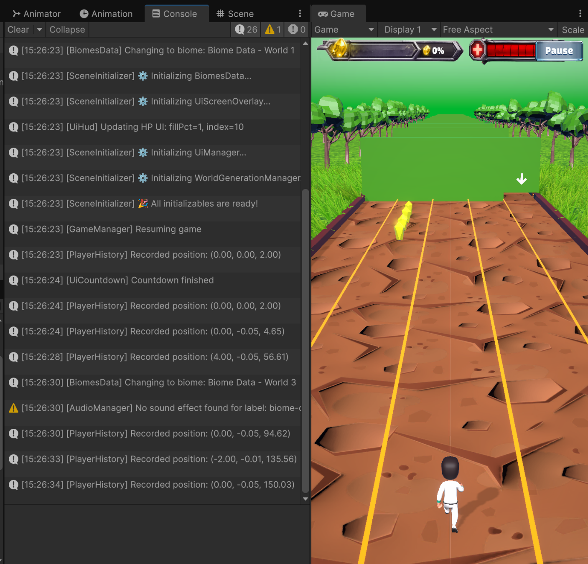
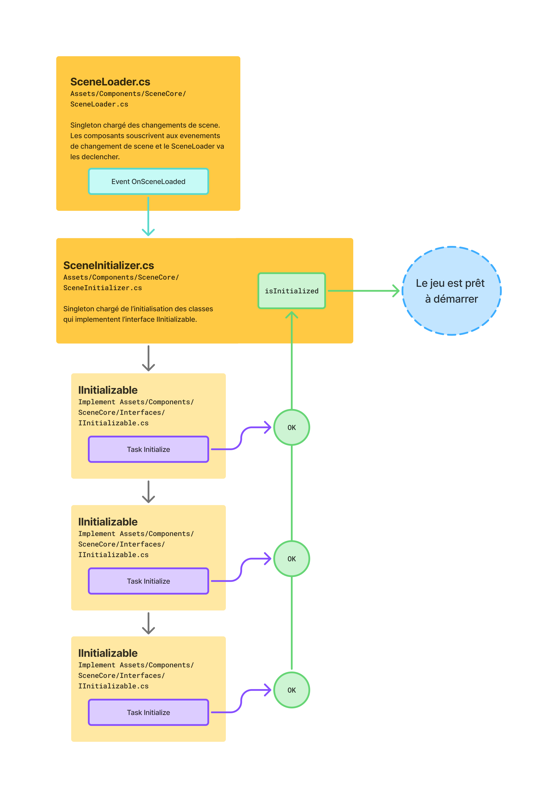
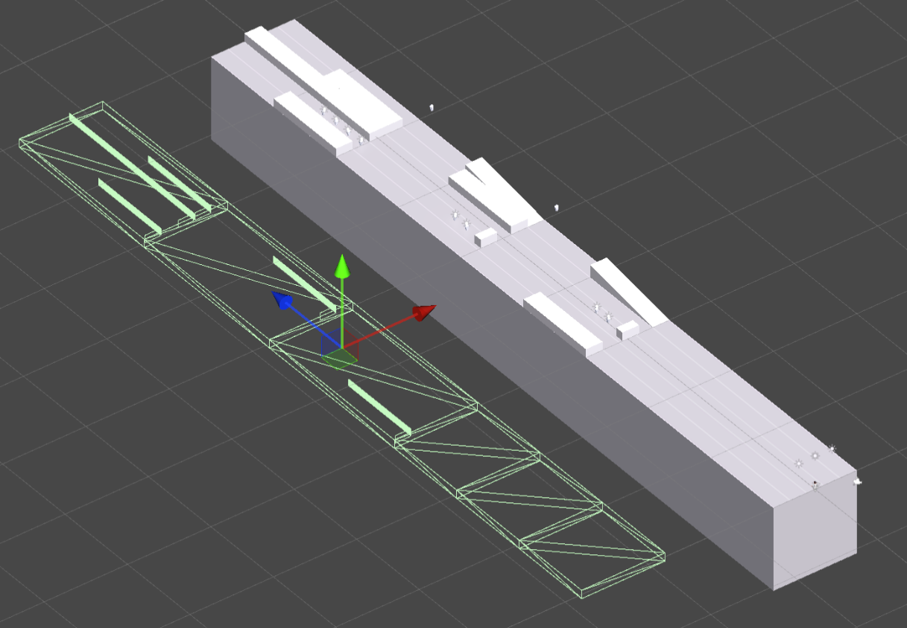
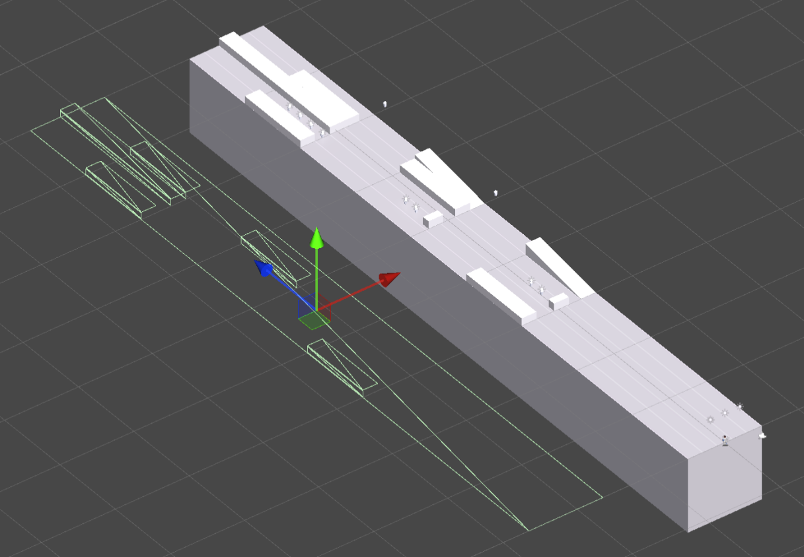
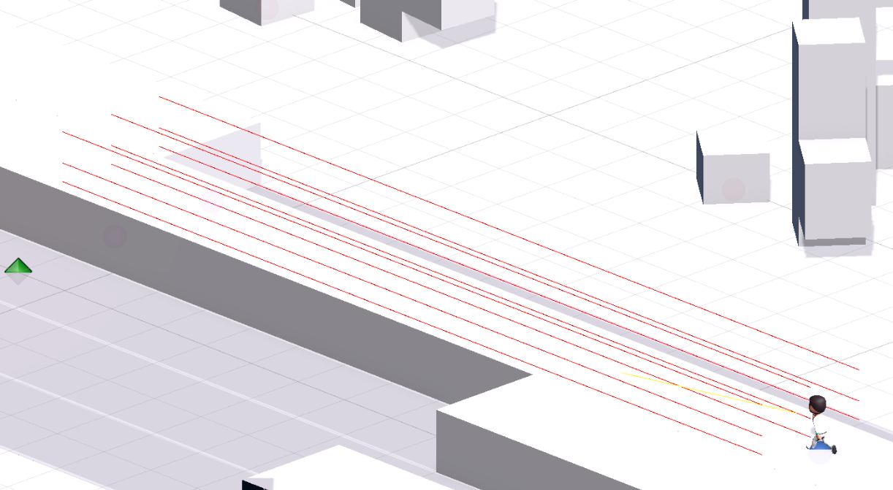

# Pour jouer au jeu


Le jeu est disponible en ligne ici (Build WebGL et Linux) :
[Itch.io - ChromAdventure](https://kzlucas.itch.io/chromadventure)


# Introduction

Ce repo contient le code source et les ressources du projet Unity du jeu **ChromAdventure**.
Il s'agit d'un jeu d'aventure en 3D de type *Infinite Runner* créé dans le cadre du cours de Programmation de Jeux Vidéo dispensé par Gaming Campus.

Le jeu met en scène un personnage qui court à travers des environnements colorés et variés, collectant des objets et évitant des obstacles pour atteindre le score le plus élevé possible.

Le cahier des charges du projet est disponible ici : [GamingCampus-CDC-dev-jv.pdf](Documentation/GamingCampus-CDC-dev-jv.pdf).

## Credits

Le jeu est créé sur la base du Game Design Document (GDD) suivant : [ChromAdventure_Game-Design-Document.pdf](Documentation/ChromAdventure_Game-Design-Document.pdf).

Les personnes ayant participé à la création de ce GDD sont :

- Alex Gonzalez 
- Lucas Mortier 
- Lucas Tesseron
- Mina Ineflas 
- Nathan Letessier
- Rudy Luna 
- Samuel Zerbib 
- Sébastien Frayssinet
- Thomas Menant 
- Vincent Distribué

Les comptes rendus des réunions de création du GDD sont disponibles ici [ChromAdventure_Game-Design-Document_Comptes-rendu-reu.pdf](Documentation/ChromAdventure_Game-Design-Document_Comptes-rendu-reu.pdf).

L'enseignant encadrant le projet est :

- Yona Rutkowski ([@Skuuulzy](https://github.com/Skuuulzy))

Le projet ayant été développé par l'enseignant durant les cours est disponible ici : [InfiniteRunnerMontreal
](https://github.com/Skuuulzy/InfiniteRunnerMontreal) 

Le développement de ce prototype du jeu a démarré mi décembre 2025 et s'achève début février 2026.Il est réalisé par la personne suivante :

- Lucas Tesseron ([@kzlucas](https://github.com/kzlucas))

Les assets du projets notamment graphiques et sonores proviennent de ressources libres de droits :


- Musique - [licence](https://pixabay.com/service/license-summary/)
    - Musique du menu principal : ["Ambient game"](https://pixabay.com/sound-effects/musical-ambient-game-67014/) de JeltsinSH
    - Musique de fond du jeu : ["Game Roblox Gaming Background Music"](https://pixabay.com/music/bloopers-game-roblox-gaming-background-music-347589/) de Tunetank

- Effets sonores - [licence](https://pixabay.com/service/license-summary/)
    - [265 - fiezewarthog](https://pixabay.com/sound-effects/film-special-effects-265-41177/)
    - [Button Click - freesoundeffects](https://pixabay.com/sound-effects/film-special-effects-button-click-289742/)
    - [land2 - deleted_user_10023915](https://pixabay.com/sound-effects/film-special-effects-land2-43790/)
    - [Magazine Slide - MootMcnoodles](https://pixabay.com/sound-effects/film-special-effects-magazine-slide-100131/)
    - [Drop Coin - Crunchpix Studio](https://pixabay.com/sound-effects/film-special-effects-drop-coin-384921/)
    - [Thump - Macif](https://pixabay.com/sound-effects/household-thump-105302/)
    - [HealPop - shyguy014](https://pixabay.com/sound-effects/film-special-effects-healpop-46004/)

- Models 3D
    - [Kenney - Animated Characters 2](https://kenney.nl/assets/animated-characters-2) - [licence CC0 1.0 Universal (CC0 1.0) Public Domain Dedication](https://creativecommons.org/publicdomain/zero/1.0/)
    - [Transparent Glass Hourglass - Ayd3n91](https://sketchfab.com/3d-models/transparent-glass-hourglass-4249e12fc0904c28886ea688daced98c) - [licence CC AttributionCreative Commons Attribution](https://creativecommons.org/licenses/by/4.0/)
    - [Low Poly Spinning Heart! - mano1creative](https://sketchfab.com/3d-models/low-poly-spinning-heart-17cf0dbe4435434eb6e04394fd5bf7ae) - [licence CC AttributionCreative Commons Attribution](https://creativecommons.org/licenses/by/4.0/)
    


- Splash screen du jeu et elements HUD

    - Généré par DALL·E 3 (https://chat.openai.com/) - [Usage commercial et non-commercial autorisé](https://openai.com/policies/terms-of-use/)
    


# Architecture generale du projet


## Environnement de développement

Le projet a été réalisé avec le moteur de jeu **Unity (version 6000.2.8f1)** et utilise le langage de programmation C#. Il a été développé sous Linux, en utilisant l'IDE **Visual Studio Code**. À noter que le projet cible deux plateformes de build : Linux et WebGL. Il prend donc en considération les contraintes et les optimisations nécessaires pour ces plateformes (WebGL en particulier).


## Structure du Repo

- `Documentation/` : Contient la documentation du projet, y compris le GDD et d'autres ressources pertinentes.

- `Assets/` : Contient tous les assets du projet Unity, y compris les scripts, les modèles 3D, les textures, les sons, etc.

    - `Assets/Animations/` : Contient les animations utilisées pour les personnages et les objets du jeu.
    - `Assets/Audio/` : Contient les fichiers audio utilisés dans le jeu.
    - `Assets/Graphics/` : Contient les éléments graphiques tels que les sprites et les UI.
    - `Assets/Materials/` : Contient les matériaux utilisés pour les modèles 3D.
    - `Assets/Models/` : Contient les modèles 3D utilisés dans le jeu.
    - `Assets/Prefabs/` : Contient les prefabs utilisés pour instancier des objets dans les scènes.
    - `Assets/Resources/` : Contient les ressources chargées dynamiquement pendant l'exécution du jeu.
    - `Assets/Scenes/` : Contient les différentes scènes du jeu.
    - `Assets/Scripts/` : Contient tous les scripts C# utilisés dans le projet.
    - `Assets/Settings/` : Contient les fichiers de configuration et les paramètres du projet Unity.
    - `Assets/Shaders/` : Contient les shaders utilisés pour les effets visuels dans le jeu.
    - `Assets/Terrains/` : Contient les terrains utilisés pour créer les environnements du jeu.
    - `Assets/UI Toolkit/` : Contient les éléments de l'interface utilisateur du jeu.


## Procedure de Tests

Les tests unitaires et les tests d'intégration n'ont pas été mis en place dans ce projet en raison de contraintes de temps et de ressources. Cependant, des tests manuels ont été effectués pour vérifier le bon fonctionnement des principales fonctionnalités du jeu.

Tout au long du développement:
- en utilisant la console de l'éditeur Unity avec [`de nombreux Debug`](https://github.com/search?q=repo%3Akzlucas%2Finfinite-runner%20Debug&type=code) : `Debug.Log`, `Debug.DrawRay`, `Debug.Break`, `OnDrawGizmos`...
- en utilisant l'éditeur Unity pour simuler différentes situations de jeu et vérifier les comportements attendus.
- en jouant au jeu régulièrement pour identifier et corriger les bugs et les problèmes de gameplay.
- en faisant des builds du jeu pour tester les performances et la compatibilité sur différentes plateformes (Linux et WebGL).



Le prototype a été envoyé au groupe de travail sur Discord pour demander des retours et identifier d'éventuels bugs ou problèmes de gameplay. Quelques bugs ont été remontés et corrigés avant la version finale du prototype.


#### Description de la procedure de test manuelle utilisee :

1. Démarrer le jeu
2. Vérifier l'affichage du menu principal
3. Cliquer sur Start
4. Vérifier le chargement de la scène de jeu
5. Vérifier le système de génération procédurale du monde
6. Jouer au jeu
  - Vérifier le déplacement du personnage
  - Vérifier le saut et la glissade
  - Vérifier la collecte des cristaux
  - Vérifier les collisions avec les obstacles
  - Vérifier la perte de points de vie
  - Vérifier le système de rewind
  - Vérifier l'affichage du score et des cristaux collectés
7. Perdre la partie
  - Vérifier l'affichage de l'écran de fin de partie
  - Vérifier le calcul du score final
8. Redémarrer une nouvelle partie
  - Vérifier le rechargement de la scène de jeu
  - Recommencer les tests de jeu (1 à 6)
9. Vérifier les paramètres audio
  - Muter et démuter le son
  - Vérifier le volume sonore
10. Vérifier la mise en pause du jeu
  - Vérifier l'ouverture/fermeture du menu pause en appuyant sur Échap
  - Vérifier l'ouverture/fermeture du menu pause en appuyant sur le bouton Pause
  - Reprendre le jeu
  - Vérifier la reprise du jeu
11. Arrêter le jeu
15. Vérifier si le fichier local de sauvegarde a bien été écrit
12. Démarrer le jeu
15. Vérifier la persistance des statistiques du joueur (meilleur score, cristaux collectés) après redémarrage du jeu
13. Vérifier la persistance des paramètres audio dans le menu
14. Arrêter le jeu
15. Vérifier les erreur et warnings dans la console de l'éditeur Unity et corriger si nécessaire


#### Description de la procédure de test du Tutorial utilisée :

1. Supprimer les PlayerPrefs dans l'éditeur Unity
2. Supprimer le fichier de sauvegarde local (savefile.json) s'il existe (méthode Editor `SaveService::DeleteSave`)
3. Démarrer le jeu
4. Vérifier l'affichage du menu principal
5. Cliquer sur Start
6. Vérifier le chargement de la scène de jeu
7. Jouer et vérifier la completion du tutorial pas à pas :
  - Vérifier l'affichage du message "Comment se Déplacer horizontalement"
  - Vérifier l'affichage du message "Comment Sautez"
  - Vérifier l'affichage du message "Comment Glissez"
  - Vérifier l'affichage du message "Collectez des Cristaux"
  - Vérifier l'affichage du message "Tutoriel complété"
8. Arrêter le jeu
9. Démarrer le jeu
10. Vérifier que le tutorial ne se lance pas à nouveau

#### Procedure de test des mondes

À noter que pour chaque nouveau segment de monde ajoutés au cours du développement, une procédure de test manuelle a été réalisée pour vérifier que le segment s'intègre correctement dans le système de génération procédurale du monde mais aussi qu'il ne provoque pas de problèmes de collisions ou de rebondissements indésirables, que le joueur peut bien le franchir, que les obstacles sont bien placés, etc.

## Suivi des features

Tableau de suivi des principales features développées au cours du projet :
[Google Sheet Document](https://docs.google.com/spreadsheets/d/1VynXDeEw_dpZwPe93qpfKKuDYcDk6X5uEqaUhXpRSZ0/edit?gid=0#gid=0)


## Commentaire de code et formatage

Les méthodes et les classes sont commentées à l'aide de commentaires XML pour faciliter la compréhension du code et la génération de documentation automatique.

À noter que les commentaires XML sont utilisés principalement pour documenter les classes et les méthodes publiques, tandis que les commentaires en ligne (// ou /* */) sont utilisés pour expliquer des sections de code plus complexes ou des logiques spécifiques.

Le code source du projet suit en partie les conventions de nommage et de formatage standard de C#. Les classes, méthodes et variables sont nommées de manière descriptive pour faciliter la compréhension du code.

Ici les conventions de nommage et de formatage utilisées dans ce projet qui ont été respectées :

- ✅ PascalCase (UpperCamelCase) : Classes, méthodes, propriétés, espaces de noms (namespaces), interfaces (IInterface)
- ✅ camelCase (LowerCamelCase) : Variables locales, paramètres de méthode
- ❌ Champ privé (private fields) : _camelCase (underscore + camelCase).
- ❌ Constantes : PascalCase ou UPPER_CASE
- ✅ Interfaces : Commencent par une majuscule 'I'.
- ✅ Booléens : Préfixer par Is, Can, Has. 
- ⚠️ Accolades : Utiliser le style Allman (accolades ouvrant et fermant sur une nouvelle ligne). --> Sur ce point, j'ai assez souvent omis les accolades lorsqu'il n'y avait qu'une seule instruction dans un bloc conditionnel ou de boucle. Pour le reste le style Allman a été respecté.
- ✅ Indentation : 4 espaces (ne pas utiliser de tabulations).
- ✅ var keyword : Utiliser var lorsque le type est évident à droite de l'assignation, sinon préciser le type.
- ⚠️ Nommage des fichiers : Faire correspondre le nom de la classe au nom du fichier (ex: Class1.cs). --> Sur ce point, j'ai parfois plusieurs classes dans un même fichier lorsque ces classes sont petites et fortement liées entre elles.
- ✅ Commentaires : Utiliser // pour les commentaires sur une seule ligne. 

## Input System

La classe [`InputHandlersManager`](Assets/Scripts/Inputs/InputHandlersManager.cs) est responsable de la gestion des entrées utilisateur. Elle utilise le système d'Input de Unity pour détecter les actions de l'utilisateur et déclencher les événements appropriés.

Les composants du projet peuvent utiliser cette classe pour mapper un input à une fonction en utilisant la méthode `RegisterInputHandler`. Chaque handler est associé à une action spécifique et peut définir des callbacks pour les événements de pression (`OnInput`), de relâchement (`OnRelease`) et de maintien d'un input (`OnHold`).

*[Assets/Scripts/Player/PlayerController.cs](Assets/Scripts/Player/PlayerController.cs)*
```csharp 
    InputHandlersManager.Instance.Register(
        label: "Jump", 
        actionRef: jumpActionRef, 
        OnTrigger: OnJumpInputPressed
    );
```


## Singleton

Le pattern de conception [`Singleton<T>`](Assets/Scripts/Singleton.cs) a été utilisé dans plusieurs classes du projet pour garantir qu'une seule instance de ces classes existe à tout moment pendant l'exécution du jeu.


## Interfaces

Quelques Interfaces ont été utilisées pour définir des contrats entre les différentes classes du projet. Cela permet de découpler les composants et de faciliter la maintenance du code.

Elles sont disponibles dans le chemin `Assets/Scripts/Interfaces/`.

## Data

Deux services de sauvegarde de données ont été implémentés dans le projet :

- [PlayerPrefService](Assets/Scripts/DataServices/PlayerPrefService.cs) : Permet de sauvegarder et de charger des données locales en utilisant PlayerPrefs de Unity. Utilisé pour sauvegarder les paramètres du jeu (audio mute notamment).

- [SaveService](Assets/Scripts/DataServices/SaveService.cs) : Permet de sauvegarder des données plus complexes en utilisant la sérialisation JSON. Utilisé pour sauvegarder les statistiques du joueur (meilleur score, cristaux collectés, etc.).


## Audio Manager

La gestion de l'audio dans le jeu est réalisée à l'aide de la classe [`AudioManager`](Assets/Scripts/SceneCore/AudioManager.cs). Cette classe est responsable de la lecture des effets sonores et de la musique de fond dans le jeu.

*eg*
```csharp 
AudioManager.Instance.PlaySound("crash");
```

L'AudioManager utilise un dictionnaire pour stocker les clips audio et permet de jouer des sons en utilisant leur nom (`string`). Il prend en charge la lecture de sons uniques ainsi que la lecture en boucle pour la musique de fond.


## Tutorial

Un [`TutorialManager`](Assets/Scripts/Tutorials/TutorialManager.cs) a été implémenté pour guider les nouveaux joueurs à travers les mécanismes de base du jeu. Il affiche des messages contextuels à l'écran pour expliquer les contrôles et les objectifs du jeu.

## UI Toolkit

Toutes les interfaces utilisateur du jeu sont construites en utilisant le système UI Toolkit de Unity.

Tous les `GameObject`s qui contiennent le composant [`UnityEngine.UIElementsModule.UIDocument`](https://docs.unity3d.com/2021.3/Documentation/ScriptReference/UIElements.UIDocument.html) hérite de la classe [`UIController`](Assets/Scripts/UI/BaseClasses/UiController.cs) qui fournit des méthodes de base pour gérer l'affichage et la mise à jour des éléments UI. 

Toutes les fonctionnalités UI spécifiques sont implémentées dans des classes dérivées de `UIController`, telles que :

- [`UiSplashScreen`](Assets/Scripts/UI/UiSplashScreen.cs)
- [`UiPauseMenu`](Assets/Scripts/UI/UiPauseMenu.cs)
- [`UiEndGame`](Assets/Scripts/UI/UiEndGame.cs)
- [`UiHud`](Assets/Scripts/UI/UiHud.cs)
- ...


## Description des Unity tags utilisés dans le jeu

- `World Segment` : Utilisé pour identifier les segments de monde générés procéduralement.
- `Composite Square Collider` : Utilisé pour identifier les colliders composites utilisé par le système de fusion des colliders.
- `Slot` : Identifie les emplacements disponible pour les obstacles lors de la génération du monde.
- `Crystal` : Identifie les cristaux à collecter dans le jeu.


# Documentation technique sur l'architecture du code


## Initialisation de la scene

L'initialisation de la scène se fait grâce aux scripts [`SceneLoader`](Assets/Scripts/SceneCore/SceneLoader.cs) et [`SceneInitializer`](Assets/Scripts/SceneCore/SceneInitializer.cs) attaché à un GameObject [Game Core](Assets/Prefabs/Game%20Core.prefab) présent dans chaque scène du jeu.

Le "SceneLoader" est responsable du chargement des scènes et de la gestion des transitions entre celle ci. Deux événements sont déclenchés par ce script : "OnSceneLoaded" et "OnSceneExit".

Le "SceneInitializer" écoute l'événement "OnSceneLoaded" et initialise les différents éléments de la scène en fonction de celle ci.




## Choix du moteur physique

Le choix du moteur physique pour ce projet s'est porté sur l'utilisation du moteur physique 3D de Unity  notamment pour permettre de gérer les sauts du personnage sur des plateformes 3D. Le gameplay se déroule sur les 3 axes (X, Y et Z) et le personnage peut sauter et atterrir sur des plateformes de différentes hauteurs.

## Gestion des colliders

Un système de gestion des colliders a été mis en place pour résoudre un problème de rebondissements sur les bords des colliders lorsque ceux ci sont disposés côte à côte. Par nature, les éléments du monde sont une suite de segments de monde ([`WorldSegment`](Assets/Scripts/WorldGeneration/WorldSegment.cs)) qui sont assemblés les uns aux autres pour former le monde infini. Lorsque deux segments de monde sont assemblés, leurs colliders respectifs sont également mis côte à côte et cela provoque des problèmes de rebondissements pour le joueur lorsqu'il passe d'un segment à un autre. Le Rigidbody du joueur rebondit légèrement lorsqu'il touche la jonction entre deux colliders, ce qui peut perturber le gameplay.

Pour résoudre ce problème, un système de `Composite Square Colliders` a été implémenté. Ce système permet de combiner plusieurs colliders en un seul collider plus grand, éliminant ainsi les jonctions entre les colliders individuels et évitant les rebondissements indésirables.

La classe [`SquareCollidersMerger`](Assets/Scripts/Helpers/SquareCollidersMerger.cs) est responsable de la fusion des colliders carrés. Elle prend en entrée une liste de colliders individuels et les combine en un seul collider composite. Ce collider composite est ensuite utilisé pour gérer les collisions avec le joueur, assurant ainsi une expérience de jeu fluide et sans rebondissements.

À noter que cette classe prend en charge uniquement les colliders de forme carrée, ce qui est suffisant pour les besoins de ce projet.

### Sans la fusion des colliders


### Avec la fusion des colliders



## Generation du monde

La génération du monde est réalisée de manière procédurale à l'aide de segments de monde réutilisables. Chaque segment de monde est un prefab qui contient des éléments de décor, des obstacles et des objets à collecter.

Les prefabs sont stockés dans le dossier `Assets/Prefabs` et sont chargés dynamiquement pendant l'exécution du jeu.

La classe [`WorldGenerationManager`](Assets/Scripts/WorldGeneration/WorldGenerationManager.cs) est responsable de la génération du monde. Elle instancie les segments de monde à mesure que le joueur avance (`WorldGenerationManager::GenerationRoutine`). Elle supprime également les segments de monde qui sont hors de la vue du joueur, et qui ne sont plus nécessaires, afin d'optimiser les performances du jeu (`WorldGenerationManager::ClearSegmentsBehindPlayer`). Si l'utilisateur percute un obstacle, il est envoyé à une position précédente grâce au système de rewind (voir ci-dessous). Cette classe prend cela en compte dans sa logique de conservation des segments de monde.

Elle permet également de regénérer le monde lorsque le joueur a collecté suffisamment de cristaux pour atteindre un nouveau palier.

Les données sur le Monde sont stockées dans des Scriptable Objects ([`SO_BiomeData`](Assets/Scripts/WorldGeneration/SO_BiomeData.cs)), les données sur les Segments sont stockées dans des classes [`WorldSegment`](Assets/Scripts/WorldGeneration/WorldSegment.cs) ce qui permet de faciliter la configuration et la modification des segments de monde sans avoir à modifier le code.


## Rewind system

Lorsque le joueur percute un obstacle, il perd un point de vie et est renvoyé à une position précédente grâce au système de rewind. Ce système permet de repositionner le joueur à un point de contrôle antérieur, lui permettant ainsi de continuer sa progression sans repartir du début.

La classe [`PlayerHistory`](Assets/Scripts/Player/PlayerHistory.cs) est responsable du stockage et de la restauration de l'historique des positions du joueur. Elle enregistre périodiquement la position et la vitesse du joueur dans une liste de records (`PlayerHistoryRecord`). Lorsqu'un rewind est nécessaire, elle restaure la dernière position en douceur en déplaçant le joueur vers cette position en utilisant une interpolation.

Les `PlayerHistoryRecord` (*Checkpoint*) sont enregistrés seulement si le joueur a avancé d'une certaine distance depuis le dernier enregistrement, afin d'optimiser l'utilisation de la mémoire, mais aussi ils doivent être des positions qui permettent au joueur de repartir sans risquer d'être en collision avec un obstacle dans les prochaines frames. C'est le rôle de la méthode `PlayerHistory::IsSafeZoneToRespawn`.

Cette méthode va vérifier que le joueur n'est pas entrain de sauter, de glisser ou de changer de voie mais aussi que la position actuelle du joueur est suffisamment éloignée des obstacles présents dans un espace défini autour de cette position. Si des obstacles sont detectes dans cet espace, la position n'est pas consideree comme une zone sure pour le respawn, et le record n'est pas enregistre. Elle verifie egalement que le sol continue sous les pieds du joueur pour eviter de respawner au bord d'un precipice.

### Les Rays envoyés pour detecter les obstacles autour de la position du joueur
Ici la position semble sur pour un respawn car aucun obstacle n'est detecté dans la zone definie.



## Player Component

### Controller

Le joueur est représenté par la classe [`PlayerController`](Assets/Scripts/Player/PlayerController.cs) qui gère les différentes actions du joueur telles que le déplacement, le saut, la glissade et la collecte d'objets.

Ce contrôleur utilise un système d’états ([**State Machine**](Assets/Scripts/StatesMachine/StateMachine.cs)) pour gérer les différentes actions du joueur. Chaque état est représenté par une classe dérivée de la classe abstraite [`PlayerState`](Assets/Scripts/Player/States/PlayerState.cs). Les états actuels sont :

- [`MoveState`](Assets/Scripts/Player/States/MoveState.cs) : Gère le déplacement latéral du joueur.
- [`CrashState`](Assets/Scripts/Player/States/CrashState.cs) : Gère l’état de collision du joueur avec un obstacle.
- [`JumpState`](Assets/Scripts/Player/States/JumpState.cs) : Gère le saut du joueur.
- [`SlideState`](Assets/Scripts/Player/States/SlideState.cs) : Gère la glissade du joueur.
- [`IdleState`](Assets/Scripts/Player/States/IdleState.cs) : Gère l’état d'attente du joueur.
- [`LandState`](Assets/Scripts/Player/States/LandState.cs) : Gère l'atterrissage du joueur après un saut.
- [`RewindState`](Assets/Scripts/Player/States/RewindState.cs) : Gère le rewind du joueur après une collision.


### Collision Handler

La classe [`PlayerCollisionHandling`](Assets/Scripts/Player/PlayerCollisionHandling.cs) est responsable de la gestion des collisions du joueur avec les obstacles et les objets à collecter. Elle détecte les collisions et déclenche les actions appropriées en fonction du type d'objet touché.

À noter que le Player comporte 4 différents colliders pour détecter les collisions sur différentes parties du corps du joueur (corps, côté gauche, côté droit, avant). 

*[Assets/Scripts/Player/PlayerCollider.cs](Assets/Scripts/Player/PlayerCollider.cs)*
```csharp 
public enum ColliderPosition
{
    Body,
    Left,
    Right,
    Front,
}
```
Cela permet de différencier la collision du corps principal du joueur (Body) et les collisions sur les côtés (Left, Right) ou l'avant (Front) du joueur. Une collision avec un obstacle détectée par le collider avant (Front)  déclenche le crash du joueur, tandis qu'une collision détectée par les collider Body peut vouloir simplement dire que le joueur a heurté le collider du sol lorsqu'il a atterri après un saut.
